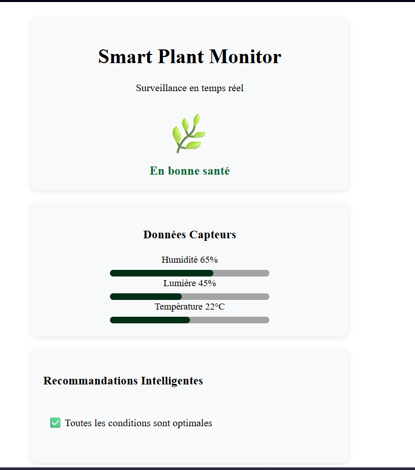
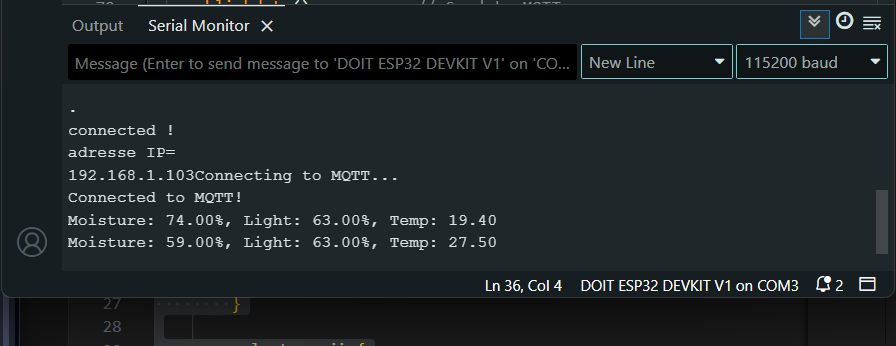

# smart-plant-monitor-

*Surveillance en temps réel des plantes avec ESP32 , protocoles MQTT et dashboard web*

<b> Context </b> 

*Ce projet a été développé comme **preuve de concept** d'une architecture IoT complète . Les données dont simulées mais le système est concu pour intégrer facilement des capteurs physiques ( DHT22 , capteur d'humidité sol ) pour un déploiement réel .*

## Technologies utilisées 

-**Microcontroleur** : ESP32 

-**Protocole** : MQTT 

-**Broker MQTT** : test.mosquitto.org 

-**Frontend** : HTML , CSS , JAVASCRIPT 

-**Backend** : C++ (Arduino) 

-**Communication** : WebSockets 

## Fonctionnalités 

-**Monitoring temps réel** via MQTT 

-**Dashboard web** 

-**Recommandations intelligentes** 

-**Architecture publish/subscribe**

-**Simulation réaliste** des données capteurs 

<b> Paramètres Surveillés </b> 
- Humidité
- Intensité lumineuse
- Temperature

## Captures d'écrans 

### Dashboard web 
 

### Sortie Serial ESP32 
 

### Afichage  
 

### Implémentation Future
- Intégration Cloud
- Application mobile pour notifications 

  

